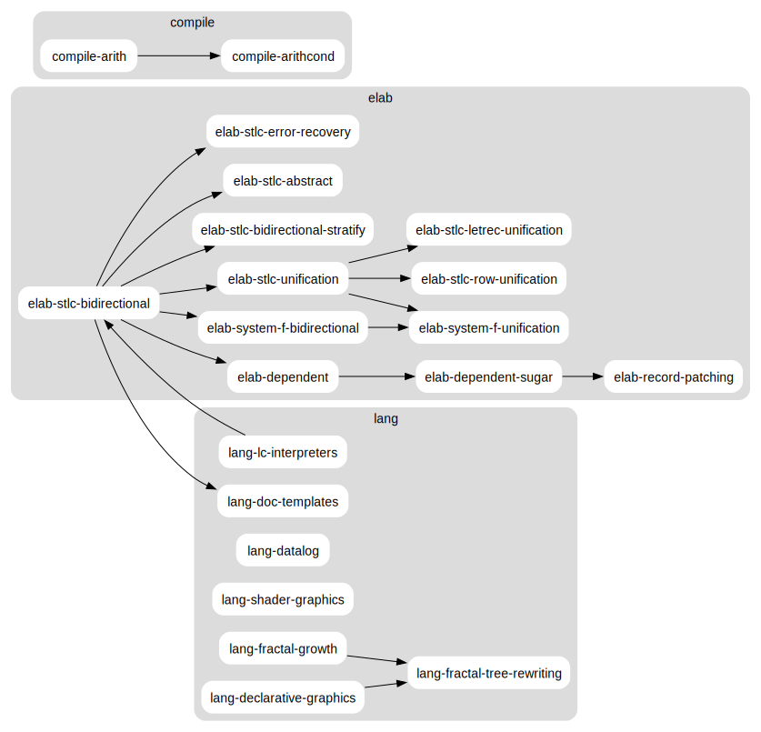

# Language garden 🌱

Some toy programming language implementations, mostly implemented in OCaml.

These projects are mostly my attempt to understand different techniques for
implementing programming languages, and as a way to share these techniques with
others.

This is part of my ongoing work at [YesLogic](https://yeslogic.com/)[^fathom],
but is also deeply rooted in my long-term interest in programming languages as
tools for thought, and as works of computational world building. Perhaps from
these seedlings something new and interesting might germinate?

[^fathom]: [yeslogic/fathom](https://github.com/yeslogic/fathom):
  A declarative data definition language for formally specifying binary data formats.

## The garden path

### Elaboration

Elaboration is an approach to implementing language front-ends where a complicated,
user friendly _surface language_ is type checked and lowered to a simpler, typed
_core language_. This approach to type checking is particularly popular and
useful for implementing dependently typed programming languages, but is more
widely applicable as well.

Simply typed:

- [**elab-stlc-bidirectional**](./elab-stlc-bidirectional):
  An elaborator for a simply typed lambda calculus that uses bidirectional
  typing to allow some type annotations to be omitted.
- [**elab-stlc-error-recovery**](./elab-stlc-error-recovery):
  An elaborator for a simply typed lambda calculus with support for reporting
  multiple errors during type checking.
- [**elab-stlc-bidirectional-stratify**](./elab-stlc-bidirectional):
  An elaborator that partially stratifies a combined type and term language into
  a simply typed core language.
- [**elab-stlc-abstract**](./elab-stlc-abstract):
  An LCF-style elaborator that moves the construction of well-typed terms behind
  a trusted interface.
- [**elab-stlc-unification**](./elab-stlc-unification):
  An elaborator for a simply typed lambda calculus where type annotations can be omitted.
- [**elab-stlc-letrec-unification**](./elab-stlc-letrec-unification):
  Extends the simply typed lambda calculus with recursive let bindings.
- [**elab-stlc-row-unification**](./elab-stlc-row-unification):
  Extends the simply typed lambda calculus with structural record and variant
  types, inferring types eagerly using constraint based unification.

Polymorphically typed:

- [**elab-system-f-bidirectional**](./elab-system-f-bidirectional):
  An elaborator for a higher-rank polymorphic lambda calculus.
- [**elab-system-f-unification**](./elab-system-f-unification):
  An elaborator for a higher-rank polymorphic lambda calculus where explicit
  type applications and type annotations can be omitted.

Dependently typed:

- [**elab-dependent**](./elab-dependent/):
  An elaborator for a small dependently typed lambda calculus.
- [**elab-dependent-sugar**](./elab-dependent-sugar/):
  An elaborator for a small dependently typed lambda calculus with syntactic sugar.
- [**elab-record-patching**](./elab-record-patching/):
  An elaborator of a dependently typed lambda calculus with singletons and record patching.

### Compilation

These are related to compilation. Mainly to stack-machines, but I’m interested
in exploring more approaches in the future, and other compilation passes
related to compiling functional programming languages.

- [**compile-arith**](./compile-arith/):
  Compiling arithmetic expressions to stack machine instructions and A-Normal Form.
- [**compile-arithcond**](./compile-arithcond/):
  Compiling arithmetic and conditional expressions to stack machine instructions and A-Normal Form.

### Languages

Miscellaneous programming language experiments.

- [**lang-datalog**](./lang-datalog/):
  A simple Datalog interpreter.
- [**lang-declarative-graphics**](./lang-declarative-graphics/):
  Declarative DSL for 2-dimensional graphics.
- [**lang-doc-templates**](./lang-doc-templates/):
  A programmable document template language that elaborates to a typed lambda calculus.
- [**lang-fractal-growth**](./lang-fractal-growth/):
  Experiments with using grammars and rewriting systems to model fractal growth.
- [**lang-fractal-tree-rewriting**](./lang-fractal-tree-rewriting/):
  Plant growth modelled as tree rewriting systems.
- [**lang-lc-interpreters**](./lang-lc-interpreters/):
  A comparison of lambda calculus interpreters using different approaches to
  name binding.
- [**lang-shader-graphics**](./lang-shader-graphics/):
  An embedded DSL for describing procedural graphics, based on signed distance
  functions. These can be rendered on the CPU or compiled to GLSL shaders.

### Scraps

Many other smaller examples and unfinished projects can be found in the
[scraps](./scraps/) directory.

## Project dependency graph

This diagram shows the flow of ideas and techniques between the various projects
listed above. If you are struggling to understand concepts in a later project,
it might be worth going back to an earlier one to see a simpler version.



## Background

As I’ve been working in the area of programming languages I’ve often found
myself in the position of:

- Explaining the same idea or technique over and over, but not having a minimal
  example I can point to.
- Re-implementing an existing technique (either from a paper, or based on some
  other existing code I’ve seen) in my own way, as a way of learning and
  understanding it more deeply.
- Wanting a place to experiment with an approach before committing to using it
  in a larger project, which can take time and may amount to nothing.
- Trying to recall a technique I’d spent time learning a long ago.
- Having an idea for a small language experiment that does not need to be part
  of a standalone project, but may require some build system setup.

My hope is that by collecting some of these projects and experiments together
into a single repository they might be useful to others and my future self.

I’m also trying to get better at interleaved breadth-first/depth-first search as part of my learning process -
somewhat like the search strategy employed by [miniKanren](http://minikanren.org/).
My goal is not to become an expert of one thing,
but to be able to be good at combining ideas from different places and perspective.

## Related work

The metaphor of a “garden” as related to knowledge work was inspired by the rising
popularity of “digital gardening” (which apparently originates from
[Hypertext Gardens](https://www.eastgate.com/garden/Enter.html)).
While this project is less directly interconnected than other digital gardens,
I still like the idea of each project being a “seedling” that can be nurtured
and tended to over an extended period of time,
with the learning from one project being transferred to the others.
Perhaps a “language nursery” would have been a more fitting name.

I’ve also been particularly inspired by Mark Barbone’s [small, self-contained gists](https://gist.github.com/mb64/)
implementing small type systems and solvers, and Andras Kovacs’ excellent
[elaboration-zoo](https://github.com/AndrasKovacs/elaboration-zoo/) (which was
instrumental in helping me get my head around how to implement elaborators).

If you like this repository, you might find these interesting as well:

- [github:andrejbauer/plzoo](https://github.com/andrejbauer/plzoo/):
  Andrej Bauer’s minimnal programming language demonstrations
- [github:AndrasKovacs/elaboration-zoo](https://github.com/AndrasKovacs/elaboration-zoo/):
  Minimal implementations for dependent type checking and elaboration by Andras Kovacs
- [github:gallais/potpourri](https://github.com/gallais/potpourri/): G. Allais’ research code
- [github:mspertus/TAPL](https://github.com/mspertus/TAPL): Updated type system
  implementations from Benjamin Pierce's “Types and Programming Languages”
- [github:pigworker/Samizdat](https://github.com/pigworker/Samizdat):
  Conor McBride’s programming scrapbook
- [github:tomprimozic/type-systems](https://github.com/tomprimozic/type-systems):
  Implementations of various type systems in OCaml

Other project gardens:

- [github:jake-87/project-garden](https://github.com/jake-87/project-garden/):
  A garden for small projects
- [github:jakob-schuster/language-scrapyard](https://github.com/jakob-schuster/language-scrapyard):
  Scrappy implementations of programming language ideas
- [github:qexat/PLAGE](https://github.com/qexat/PLAGE/):
  Programming Language Adjacent General Experiments
- [github:RiscInside/LanguageEtudes](https://github.com/RiscInside/LanguageEtudes/):
  Single-file typechecker/interpreter/compiler implementations
- [github:yeslogic/fathom-experiments](https://github.com/yeslogic/fathom-experiments/):
  Fathom related experiments
- [sourcehut:icefox/determination](https://hg.sr.ht/~icefox/determination):
  Type checkers for System F and System Fω

## Conventions and style choices

### Provide lots of type annotations

The predominant style in OCaml of leaving off type annotations
makes understanding and porting code far more difficult.
Instead I try to add type annotations to most top-level type signatures.

### Avoid opening modules

When `open` is used I find it hard to figure out where identifiers are coming from without an editor.
Instead I prefer using an explicitly qualified path where possible.

### Group related variants with a common prefix

In the past I’ve often found it hard to find related nodes in an AST
when trying to understand other people’s code.
For example, the following variants might all refer to different parts of a dependent pair type:

```ocaml
type tm =
  ...
  | Sig of string * tm * tm
  | Pair of tm * tm
  | Fst of tm
  | Snd of tm
```

Instead I prefer to use the following constructors:

```ocaml
type tm =
  ...
  | Pair_type of string * tm * tm
  | Pair_lit of tm * tm
  | Pair_fst of tm
  | Pair_snd of tm
```

### Use types to disambiguate variant names

OCaml’s variant constructors aren’t namespaced under the type like in Rust or Lean,
so reusing the same variant name will result in ambiguities
if you are relying on global type inference.
Generally OCaml programmers will either:

1. Wrap every type in a module
2. Come up with an ad-hoc prefix for to prevent the conflict

I find the former convention often results in duplicated datatype definitions
(mutually dependent modules require explicit module signatures),
and the latter is a little arbitrary and ugly.

Instead I’ve decided to just disambiguate variants using the type.
I realise this might make the code a more difficult to understand
and if I come up with a better compromise I might revisit this in the future.

## Development setup

### With Nix

Using [Lix] (recommended) or [Nix] is not required, but can be useful for setting up a development
shell with the packages and tools used in this project. With [Nix flakes]
enabled:

```sh
nix run .#arith -- compile --target=anf <<< "1 + 2 * 27"
```

[nix-direnv] can be used to load development tools into your shell
automatically. Once it’s installed, run the following commands to enable it in
the project directory:

```sh
echo "use flake" > .envrc
direnv allow
```

You’ll want to locally exclude the `.envrc`, or add it to your global gitignore.

After that, [dune] can be used to build, test, and run the projects:

```sh
dune build
dune test
dune exec arith -- compile --target=anf <<< "1 + 2 * 27"
```

[dune]: https://dune.build
[Lix]: https://lix.systems/
[Nix]: https://nixos.org
[Nix flakes]: https://nixos.wiki/wiki/Flakes
[nix-direnv]: https://github.com/nix-community/nix-direnv

### With opam

Alternatively, [opam] package definitions are provided in the [`./opam`](./opam)
directory. They drive the Nix flake, so _should_ be up to date. I don’t use opam
however, so I’m not sure what the workflow is.

[opam]: opam.ocaml.org
